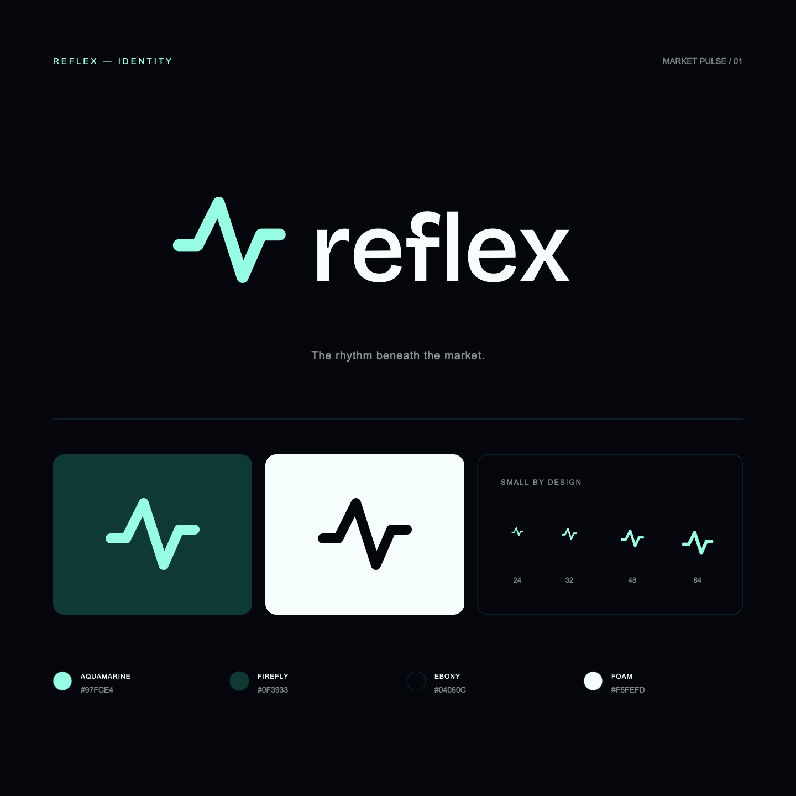

# Reflex design review

This folder contains the landing page, scanner design preview, token-access concept, and market-pulse logo proposed for Reflex. The existing frontend and backend are unchanged by this design review.



## Review the design

- `preview/`: runnable React/Vinext preview, with `/`, `/scanner`, and `/access` routes.
- `brand/`: scalable SVG symbols and outlined wordmarks, favicon, presentation, and usage guidance.
- `Token-access-proposal.md`: proposed hold-at-least-X access model.

Private hosted preview (owner access required): https://reflex-market-intelligence.openclimb.chatgpt.site/

### Run locally

Requires Node.js 22.13 or newer.

```sh
cd design/reflex/preview
npm ci
npm run dev
```

For a production build, run `npm run build`. This review copy has no dependency on the private Sites project or its publishing plugin.

## Scope

The visual system uses Aquamarine `#97FCE4`, Firefly `#0F3933`, Ebony `#04060C`, and Foam `#F5FEFD`. It includes the animated glass hero, reduced-motion handling, a responsive scanner with local watchlist preferences, and simulated access states.

Market data and signals are illustrative. Wallet balances, token thresholds, and access decisions are simulated. This is a design proposal, not production authentication or token integration. Port the reviewed components into the existing React/Vite frontend in a follow-up implementation.

## Validation

The standalone review copy passes its production build and TypeScript check. The logo presentation was inspected at small sizes. Browser interaction QA and production backend integration are outside this review.

Dependency audit: the inherited preview scaffold currently reports 11 advisories (8 high, 2 moderate, 1 low). Review and update the preview toolchain before using it as a production application.
