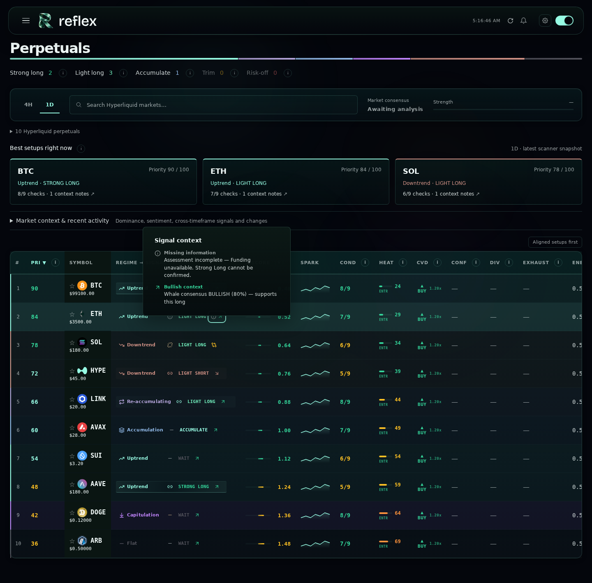
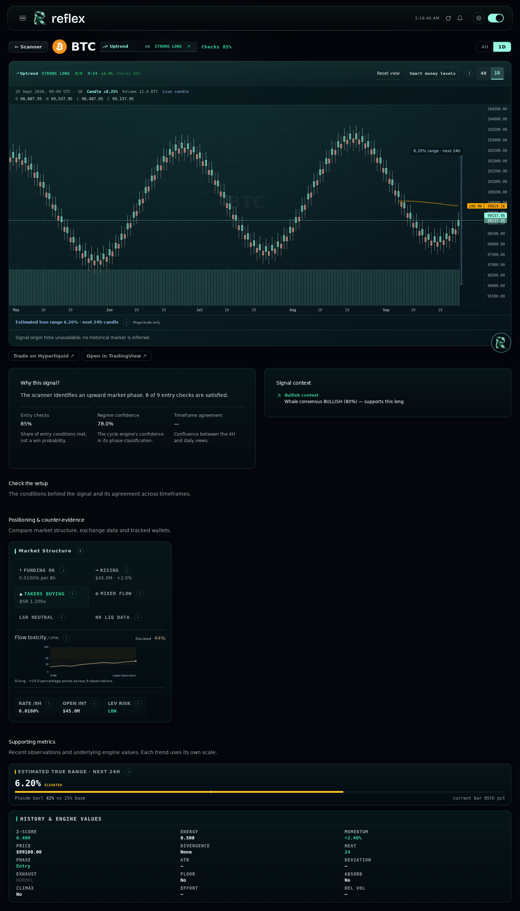
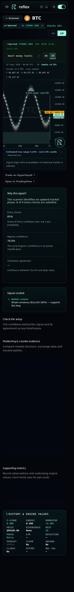
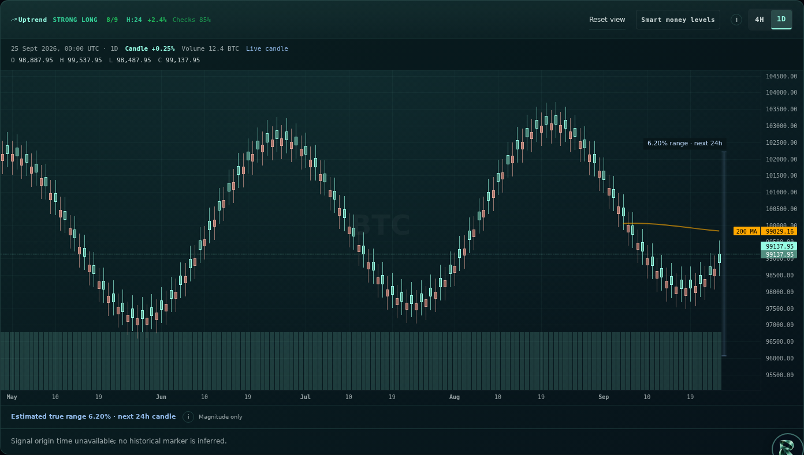
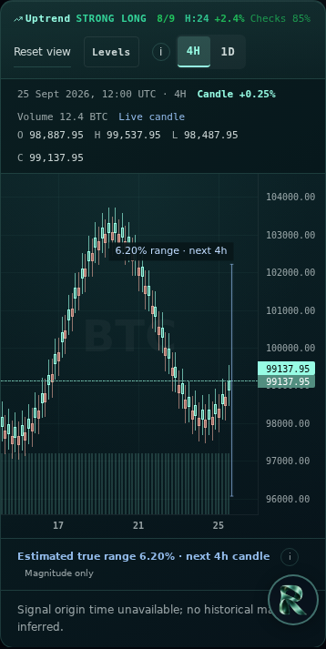

# Reflex visual clarity review

Screenshots use synthetic market data rendered inside the actual App scanner and coin-page layouts, including the real theme, header, navigation, and surrounding panels. They are not live market results.

- Distinct bullish, bearish, conflicting, caution, and missing-data context icons. Missing core checks are named and explain the Strong Long cap.
- Compact connected regime/signal typography in the scanner, drawer, and coin header. Strength controls subtle background emphasis; alignment explanations are available on hover or focus. No capsule outlines, glow, or extra status lines. Optional alignment sorting preserves existing ordering within groups; engine scores and eligibility are unchanged.
- Candle inspector shows open-to-close change, OHLC, timestamp in UTC, volume in source asset units, and live-candle status.
- Chart endpoint includes the existing range forecast for its requested timeframe. A price-scaled magnitude ruler follows pan/zoom. This is total estimated true range, not ± price targets or a containment interval. The old card's erroneous ± prefix was removed.
- Flow toxicity has a readable history, 30/55 thresholds, observation-based change, and visible zero/missing states. Copy describes the actual provider-bar imbalance proxy without presenting it as informed-trading probability.

## Verification

- Production frontend build passed (existing bundle-size warning).
- 28 frontend utility tests passed, including new status/alignment and chart-value cases.
- 9 existing backend range-forecast tests passed; modified backend module compiles.
- Headless Chromium checked the full layout at desktop (1440 px) and mobile (390 px), including the missing-context tooltip without row navigation, with zero browser errors. Earlier component checks covered candle hover and 1D/4H switching.
- Visual review corrected threshold rounding and integer-index chart ruler positioning.

The range overlay requires the updated backend chart endpoint. An older backend displays an explicit range-unavailable message. Full authenticated live-data acceptance and deployment are not performed by this PR.

## Desktop

## Coin page

## Mobile

## Chart finish refinement

The plot now uses a restrained teal surface, upper-edge highlight and layered background within the existing palette. Daily desktop history increases from 90 to 150 candles; four-hour history from 120 to 180. Smaller screens keep a readable candle width. Reset view restores time and price scaling. Coin-page chart height is 580 px on desktop and 400 px on mobile. The paired-column help explains how structure relates to the signal, with contextual explanations on each connection.

Full-layout browser checks covered the context tooltip, both chart timeframes and Reset view on desktop/mobile with no browser errors. Build and 28 utility checks passed. Previews remain synthetic data; deployment and authenticated live-data acceptance remain outstanding.

